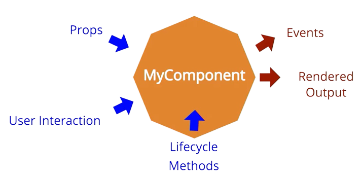

# Testing

Automated tests are very important which help you and your team build complex applications quickly and confidently by preventing regressions and encouraging you to break apart your application into testable functions, modules, classes, and components.

Before reading this guide, I highly recommend you to finish the following awesome artciles about testing:

- [Vue3 Official Docs: Testing](https://vuejs.org/guide/scaling-up/testing.html)
- [`@vue/test-utils`: Knowing What to test](https://v1.test-utils.vuejs.org/guides/#knowing-what-to-test)
- ["Component Tests with Vue.js" by Matt O'Connell](https://www.youtube.com/watch?v=OIpfWTThrK8&ab_channel=VueNYC)
- [`testing-library` Docs](https://testing-library.com/docs/)
- [End-to-End or Component Tests](https://docs.cypress.io/guides/core-concepts/testing-types#End-to-End-or-Component-Tests)

## Unit/Component Testing

We recommend to write "Blackbox tests" for component with [Testing Library](https://testing-library.com/docs/vue-testing-library/intro), in which the implementation details of a component should not be cared. The guiding principle of Testing Library is that the more tests resemble the way software is used, the more confidence they can provide.



Vitify Admin comes with three built-in testing utils in [`test/helpers.ts`](https://github.com/kingyue737/vitify-admin/blob/main/test/helpers.ts). The most frequently used method is `renderWithVuetify` which is used to mount component containing Vuetify components with Testing Library, while `createWrapper` mounts component with `@vue/test-utils`. Use `createWrapper` only if you are building advanced components that require testing Vue-specific internals. `mountComposable` funtion is used to test composables.

[`login.spec.ts`](https://github.com/kingyue737/vitify-admin/blob/main/src/pages/__tests__/login.spec.ts) and [`message.spec.ts`](https://github.com/kingyue737/vitify-admin/blob/main/src/stores/__tests__/message.spec.ts) are two examples of how to write component testing and store testing.

## E2E Testing

In Vitify Admin, we use [Cypress](https://www.cypress.io/) which provides the most complete E2E solution with features like an informative graphical interface, excellent debuggability, built-in assertions and stubs, flake-resistance, parallelization, and snapshots.

Notice that Cypress also provides support for [Component Testing](https://docs.cypress.io/guides/component-testing/writing-your-first-component-test). For components which you want to test style, or with native DOM events, cookies and localStorage, Cypress component testing which run in real browsers is a better choice than Vitest + Testing Library.

### Cypress Download Speed

Downloading Cypress binary can be extremely slow, which is a long-lived issue bothers users all around the world [#7251](https://github.com/cypress-io/cypress/issues/7251) [#17652](https://github.com/cypress-io/cypress/issues/17652) [#19612](https://github.com/cypress-io/cypress/issues/19612) [#20032](https://github.com/cypress-io/cypress/issues/20032).

Since v10.6.0, Cypress enhanced the [`CYPRESS_DOWNLOAD_PATH_TEMPLATE`](https://docs.cypress.io/guides/references/advanced-installation#Environment-variables) environment variable interpolation to accept and replace `${version}` to allow version-specific download paths to be honored. Therefore, for developers in China, we can set environment variables to download the binary from [npmmirror](https://npmmirror.com/) instead of the orginal snail-slow Cloudflare. Add the following environment variable to your system:
```bash
CYPRESS_DOWNLOAD_PATH_TEMPLATE='https://cdn.npmmirror.com/binaries/cypress/${version}/${platform}-${arch}/cypress.zip'
```
