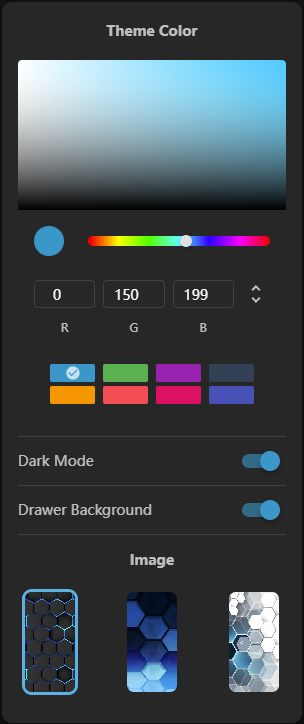

# Theme

Theme configuration of Vitify Admin is based on [Vuetify theme](https://vuetifyjs.com/en/features/theme/), which allows you to easily change the colors of your application programmatically.

## Dynamic Theme

Vitify Admin allows users to toggle dark/light mode and change primary theme color. You can click the button with palette icon on the end of the footer to display the theme settings menu.



The implementation is simple. Just change the related property of your Vuetify instance.
```vue
// src/components/layout/ButtonSettings.vue
<script setup lang="ts">
import { useVuetify } from '@/composables/useVuetify'
import { useDark, useToggle } from '@vueuse/core'

const vuetify = useVuetify()
// Change primary theme color by modifying `vuetify.theme.themes.light.primary`
// and `vuetify.theme.themes.dark.primary`
const color = computed({
  get() {
    return vuetify!.theme.themes.light.primary as string
  },
  set(val: string) {
    localStorage.setItem('theme-primary', val)
    vuetify!.theme.themes.light.primary = val
    vuetify!.theme.themes.dark.primary = val
  },
})

// Change theme by modifying `vuetify.theme.dark`
const isDark = useDark({
  onChanged(dark: boolean) {
    vuetify.theme.dark = dark
  },
})
const toggleDark = useToggle(isDark)
</script>
```

Whether the default theme is dark or light depends on users' system preferences. This feature is implemented by [`useDark`](https://vueuse.org/core/usedark/) of [VueUse](https://vueuse.org/).
